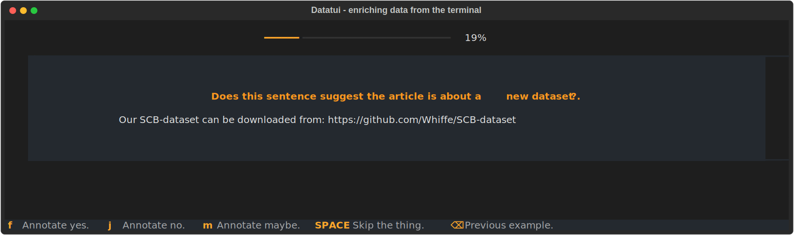
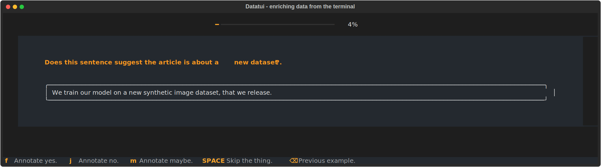
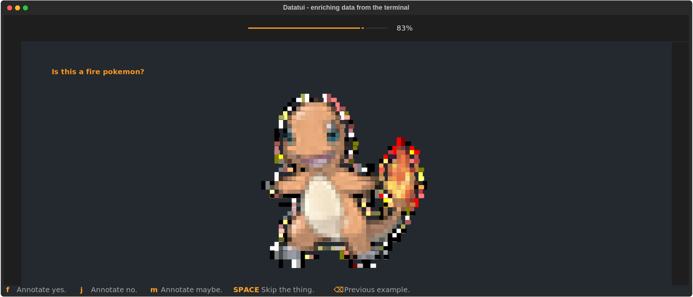

---
hide:
- toc
- navigation
---

# datatui 

A minimal, but fun, annotation tool for the terminal.



## Installation

```bash
pip install datatui
```


## Scope 

The goal of this project is to offer a constrained and minimalistic alternative to full fledged web apps for data annotation. It allows you to annotate data with just four labels: `yes`, `no`, `maybe`, `skip`. Anything that you can render nicely in [rich](https://github.com/Textualize/rich) can be used as input. This setup excludes a lot of annotation tasks that require more complex interactions, but for simple tasks it also excludes a lot of overhead. 

You only need a terminal, which also means that you can SSH into your cron server to have a look at some of your data.

## Examples

### Custom `rich` rendering

Rich comes with a lot of features that allow you to easily customise the look of what you are annotating.
You can learn more about constructing interfaces with rich [on calmcode.io](https://calmcode.io/course/rich/constructions)
but we also provide a demo below that highlights how to add panels. 



Here's the code that produces the above output.

```python
from rich.panel import Panel
import json 
from datatui import datatui, new_batch


# Read JSONL file 
def generator():
    with open("examples/arxiv.jsonl", "r") as f:
        for line in f:
            yield json.loads(line)

# Create a new batch, removes duplicates
batch = new_batch(generator(), cache_name="annotations", collection_name="default", limit=100)

if __name__ == "__main__":
    # Run a new annotation session. Notice how we customise the content_render
    # function to use rich Panels and that we add a description/progress bar to 
    # the annotation task.
    datatui(list(generator()), 
            cache_name="annotations", 
            collection_name="default",
            pbar=True, 
            description="Does this sentence suggest the article is about a [bold]new dataset[/bold]?.",
            content_render=lambda x: Panel(x["text"])
    )
```

By leveraging the `concent_render` function you can customise the look of your annotations as you see fit.

### Custom `rich` rendering, includes images! 

Thanks to a healthy ecosystem of `rich`, we can easily include images in our annotations via
the [rich-pixels](https://github.com/darrenburns/rich-pixels) plugin. Here is what that might look like.



To get this interface in `datatui` you would need to have a script like below. 

```python
from PIL import Image
from rich.align import Align
from rich_pixels import Pixels
from datatui import datatui
from pathlib import Path

stream = [{"path": str(p)} for p in Path("examples/pokemons").glob("*.png")]

def render_image(ex):
    with Image.open(ex["path"]) as image:
        resized_image = image.resize((40, 40), Image.LANCZOS)
        return Align.center(Pixels.from_image(resized_image), vertical="middle")
    

if __name__ == "__main__":
    datatui(stream, 
            cache_name="annotations", 
            collection_name="pokemon", 
            pbar=True, 
            description="Is this a fire pokemon?",
            content_render=render_image)
```

Note that this script can also be found in the examples folder of the repository.