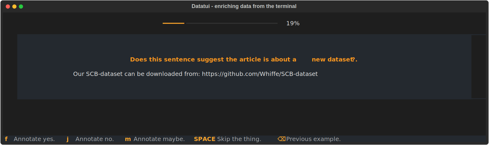

---
hide:
- toc
- navigation
---

# datatui 

A minimal, but fun, annotation tool for the terminal.



## Installation

```bash
pip install datatui
```


## Scope 

The goal of this project is to offer a constrained and minimalistic alternative to full fledged web apps for data annotation. It allows you to annotate data with just four labels: `yes`, `no`, `maybe`, `skip`. Anything that you can render nicely in [rich](https://github.com/Textualize/rich) can be used as input. This setup excludes a lot of annotation tasks that require more complex interactions, but for simple tasks it also excludes a lot of overhead. 

You only need a terminal, which also means that you can SSH into your cron server to have a look at some of your data.

## Example

This is a minimal example that shows how to use the library.

```python
import json 
from datatui import datatui, new_batch


# Read JSONL file 
def generator():
    with open("examples/arxiv.jsonl", "r") as f:
        for line in f:
            example = json.loads(line)
            example["content"] = example["text"]
            yield example

# Create a batch of examples, ensures that examples are unique and have not been seen before.
batch = new_batch(generator(), cache_name="annotations", collection_name="default", limit=100)

if __name__ == "__main__":
    datatui(
        batch, 
        collection_name="default", 
        pbar=True, 
        description="Does this sentence suggest the article is about a [bold]new dataset[/bold]?."
    )
```

From here you can run your application as any other python application.
